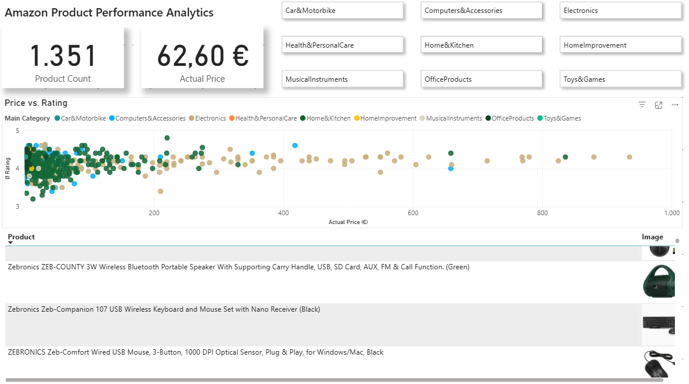

# 📊 Amazon Product Performance Analytics

An interactive Power BI dashboard analyzing 1,351 Amazon products to identify correlations between pricing strategies, customer satisfaction, and category performance.

## 🎯 Project Overview
This project transforms raw market data into actionable business insights. The focus lies on the "Price vs. Performance" nexus—helping stakeholders understand if higher price points actually translate to better customer ratings across different categories.

## 🛠️ Technical Implementation
* **Data Source:** Amazon Product Dataset (sourced from Kaggle).
* **Cloud Connectivity:** The dashboard is connected via a GitHub Raw-Link, ensuring a portable and cloud-ready data source.
* **DAX & Modeling:** * Implemented custom measures like `Product Count` to ensure precise KPI reporting.
    * Applied a Star-Schema inspired data model for optimized performance.
* **UI/UX Design:** * Consistent use of "White Space" and shadow effects for a modern app-like feel.
    * Standardized 0-decimal formatting for whole-unit KPIs to ensure professional clarity.

## 💡 Key Insights
* **Price Distribution:** The majority of high-rated products are clustered in the mid-price range, suggesting a "sweet spot" for value-for-money.
* **Category Leaders:** Analysis shows how different main categories (e.g., Electronics vs. Home & Kitchen) vary in their rating-to-price ratio.

## 📂 How to use
1. Download the `Amazon_Product_Performance_Analytics.pbix` file.
2. Open it in **Power BI Desktop**.
3. Use the category slicers at the top to filter the entire report dynamically.
